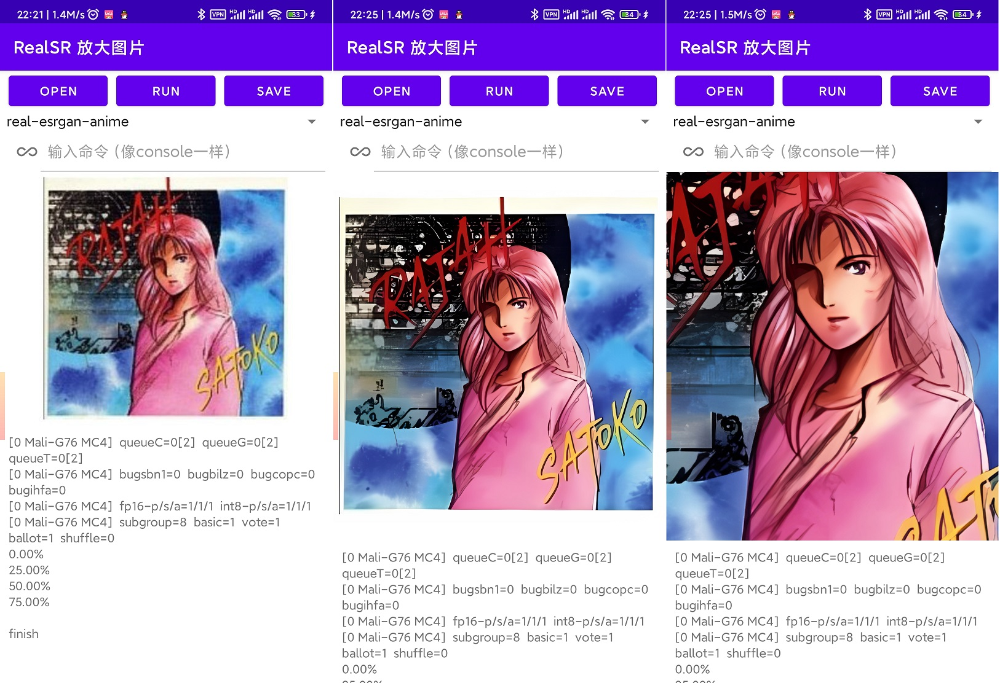

# RealSR-NCNN-Android

[中文说明](https://github.com/tumuyan/RealSR-NCNN-Android/blob/master/README_CHS.md)  

RealSR-NCNN-Android is a simple Android application that based on [RealSR-NCNN](https://github.com/nihui/realsr-ncnn-vulkan), [SRMD-NCNN](https://github.com/nihui/srmd-ncnn-vulkan), [RealCUGAN-NCNN](https://github.com/nihui/realcugan-ncnn-vulkan) & [Real-ESRGAN](https://github.com/xinntao/Real-ESRGAN).  
The application does not collect any private information from your device.  

This repository contains 5 project:  
1. RealSR-NCNN-Android-GUI can build a APK (has a GUI and easy to use). Actually it is a shell of the follow programs.
2. RealSR-NCNN-Android-CLI can build a program that can be used by the console (for example, Termux) for Android. This program can use realsr models and real-esrgan models.
3. RealCUGAN-NCNN-Android-CLI  can build a program that can be used by the console (for example, Termux) for Android.
4. SRMD-NCNN-Android-CLI can build a program that can be used by the console (for example, Termux) for Android.
5. Waifu2x-NCNN-Android-CLI can build a program that can be used by the console (for example, Termux) for Android (Not packaged in APK).

### About Real-ESRGAN

  
Real-ESRGAN is a Practical Algorithms for General Image Restoration.

> [[Paper](https://arxiv.org/abs/2107.10833)] &emsp; [[Project Page]](https://github.com/xinntao/Real-ESRGAN) &emsp; [[YouTube Video](https://www.youtube.com/watch?v=fxHWoDSSvSc)] &emsp; [[Bilibili](https://www.bilibili.com/video/BV1H34y1m7sS/)] &emsp; [[Poster](https://xinntao.github.io/projects/RealESRGAN_src/RealESRGAN_poster.pdf)] &emsp; [[PPT slides](https://docs.google.com/presentation/d/1QtW6Iy8rm8rGLsJ0Ldti6kP-7Qyzy6XL/edit?usp=sharing&ouid=109799856763657548160&rtpof=true&sd=true)]<br>
> [Xintao Wang](https://xinntao.github.io/), Liangbin Xie, [Chao Dong](https://scholar.google.com.hk/citations?user=OSDCB0UAAAAJ), [Ying Shan](https://scholar.google.com/citations?user=4oXBp9UAAAAJ&hl=en) <br>
> Tencent ARC Lab; Shenzhen Institutes of Advanced Technology, Chinese Academy of Sciences


**Note that RealESRGAN may still fail in some cases as the real-world degradations are really too complex.**

## About RealSR
[[paper]](http://openaccess.thecvf.com/content_CVPRW_2020/papers/w31/Ji_Real-World_Super-Resolution_via_Kernel_Estimation_and_Noise_Injection_CVPRW_2020_paper.pdf) [[project]](https://github.com/jixiaozhong/RealSR)  [[NTIRE 2020 Challenge on Real-World Image Super-Resolution: Methods and Results]](https://arxiv.org/pdf/2005.01996.pdf)

## About SRMD
[[paper]](http://openaccess.thecvf.com/content_cvpr_2018/papers/Zhang_Learning_a_Single_CVPR_2018_paper.pdf) [[project]](https://github.com/cszn/SRMD)
 


## About Real-CUGAN
[[project]](https://github.com/bilibili/ailab/tree/main/Real-CUGAN)
Real-CUGAN is an AI super resolution model for anime images, trained in a million scale anime dataset, using the same architecture as Waifu2x-CUNet. 

## how to build RealSR-NCNN-Android-CLI
### step1
https://github.com/Tencent/ncnn/releases
download ncnn-yyyymmdd-android-vulkan-shared.zip.

### step2
extract ncnn-yyyymmdd-android-vulkan-shared.zip into `app/src/main/jni` 

### step3
open this project with Android Studio, rebuild it and then you could find the program in `RealSR-NCNN-Android-CLI\app\build\intermediates\cmake\debug\obj`


## how to use RealSR-NCNN-Android-CLI
### Download models

I have package and upload models, also you can download models from RealSR-NCNN and Real-ESRGAN.

`https://github.com/tumuyan/RealSR-NCNN-Android/releases/download/1.4.1/models.zip`

### Example Command

make sure the elf file has execute permission. Then input command

```shell
./realsr-ncnn -i input.jpg -o output.jpg
```

### Full Usages
```console
Usage: realsr-ncnn -i infile -o outfile [options]...

  -h                   show this help
  -v                   verbose output
  -i input-path        input image path (jpg/png) or directory
  -o output-path       output image path (jpg/png) or directory
  -s scale             upscale ratio (4, default=4)
  -t tile-size         tile size (>=32/0=auto, default=0) can be 0,0,0 for multi-gpu
  -m model-path        realsr model path (default=models-DF2K_JPEG)
  -g gpu-id            gpu device to use (default=0) can be 0,1,2 for multi-gpu
  -j load:proc:save    thread count for load/proc/save (default=1:2:2) can be 1:2,2,2:2 for multi-gpu
  -x                   enable tta mode
  -f format            output image format (jpg/png, default=ext/png)
```

- `input-path` and `output-path` accept either file path or directory path
- `scale` = scale level, 4 = upscale 4x
- `tile-size` = tile size, use smaller value to reduce GPU memory usage, default selects automatically
- `load:proc:save` = thread count for the three stages (image decoding + realsr upscaling + image encoding), using larger values may increase GPU usage and consume more GPU memory. You can tune this configuration with "4:4:4" for many small-size images, and "2:2:2" for large-size images. The default setting usually works fine for most situations. If you find that your GPU is hungry, try increasing thread count to achieve faster processing.
- `format` = the format of the image to be output, png is better supported, however webp generally yields smaller file sizes, both are losslessly encoded

If you encounter crash or error, try to upgrade your derive

## how to build RealSR-NCNN-Android-GUI
download Real-ESRGAN/RealSRGAN models and put them to this folder, then build it with Android Studio

```
RealSR-NCNN-Android-GUI\app\src\main\assets\realsr
│  libncnn.so
│  libvulkan.so
│  realcugan-ncnn
│  realsr-ncnn
│  srmd-ncnn
│  
├─models-DF2K
│      x4.bin
│      x4.param
│      
├─models-DF2K_JPEG
│      x4.bin
│      x4.param
│      
├─models-nose
│      up2x-no-denoise.bin
│      up2x-no-denoise.param
│      
├─models-Real-ESRGAN
│      x4.bin
│      x4.param
│      
├─models-Real-ESRGAN-anime
│      x4.bin
│      x4.param
│      
├─models-Real-ESRGANv2-anime
│      x2.bin
│      x2.param
│      x4.bin
│      x4.param
│      
├─models-se
│      up2x-conservative.bin
│      up2x-conservative.param
│      up2x-denoise1x.bin
│      up2x-denoise1x.param
│      up2x-denoise2x.bin
│      up2x-denoise2x.param
│      up2x-denoise3x.bin
│      up2x-denoise3x.param
│      up2x-no-denoise.bin
│      up2x-no-denoise.param
│      up3x-conservative.bin
│      up3x-conservative.param
│      up3x-denoise3x.bin
│      up3x-denoise3x.param
│      up3x-no-denoise.bin
│      up3x-no-denoise.param
│      up4x-conservative.bin
│      up4x-conservative.param
│      up4x-denoise3x.bin
│      up4x-denoise3x.param
│      up4x-no-denoise.bin
│      up4x-no-denoise.param
│      
└─models-srmd
        srmdnf_x2.bin
        srmdnf_x2.param
        srmdnf_x3.bin
        srmdnf_x3.param
        srmdnf_x4.bin
        srmdnf_x4.param
        srmd_x2.bin
        srmd_x2.param
        srmd_x3.bin
        srmd_x3.param
        srmd_x4.bin
        srmd_x4.param

```


## how to use RealSR-NCNN-Android-GUI
You can open photo picker, chose a model, click the `Run` button and wait some time. The photo view will show the result when the progrem finish its work. If you like the result, you could click the `Save` button.  

Also the app could input shell command.

## screenshot

input & output


## Others project in this Repository
Building and usage is same as RealSR-NCNN-Android-CLI

## Original Project
### real-esrgan original project and models
- https://github.com/xinntao/Real-ESRGAN
### C code and others models
Most of the code is copied from Nihui, cause of the directory structure had to be adjusted, the original git was broken  
- https://github.com/nihui/realsr-ncnn-vulkan
- https://github.com/nihui/srmd-ncnn-vulkan
- https://github.com/nihui/waifu2x-ncnn-vulkan
- https://github.com/nihui/realcugan-ncnn-vulkan

## Other Open-Source Code Used
-   [https://github.com/Tencent/ncnn](https://github.com/Tencent/ncnn)  for fast neural network inference on ALL PLATFORMS
-   [https://github.com/nothings/stb](https://github.com/nothings/stb)  for decoding and encoding image on Linux / MacOS
-   [https://github.com/tronkko/dirent](https://github.com/tronkko/dirent)  for listing files in directory on Windows