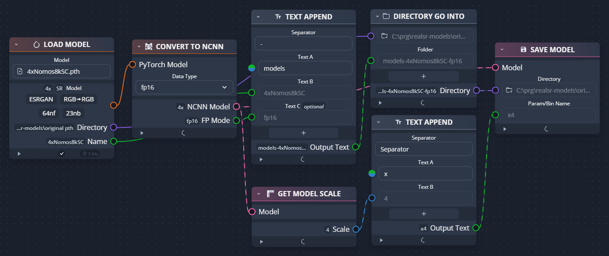

# RealSR-NCNN-Android

[中文说明](https://github.com/tumuyan/RealSR-NCNN-Android/blob/master/README_CHS.md)  

RealSR-NCNN-Android is a simple Android application that based on [Waifu2x-NCNN](https://github.com/nihui/waifu2x-ncnn-vulkan), [SRMD-NCNN](https://github.com/nihui/srmd-ncnn-vulkan), [RealCUGAN-NCNN](https://github.com/nihui/realcugan-ncnn-vulkan), [RealSR-NCNN](https://github.com/nihui/realsr-ncnn-vulkan), & [Real-ESRGAN](https://github.com/xinntao/Real-ESRGAN), [Anime4KCPP](https://github.com/TianZerL/Anime4KCPP).  
The application does not collect any private information from your device.  
Download: Github [Release](https://github.com/tumuyan/RealSR-NCNN-Android/releases) 

This repository contains 3 project:  
1. RealSR-NCNN-Android-CLI can build programs that can be used by the console (for example, Termux) for Android.It contains 6 modules (Anime4k, RealSR, RealCUGAN, SRMD, Waifu2x and Resize)   
  - The RealSR program could use realsr models and real-esrgan models.  
  - The Resize program contains classical interpolation mode `nearest` `bilinear` `bicubic` and `avir` `lancir`.
2. RealSR-NCNN-Android-GUI can build a APK (has a GUI and easy to use). Actually it is a shell for the programs build from RealSR-NCNN-Android-CLI.
3. Resize-CLI just a demo like the Resize-NCNN-Android-CLI, but it not need ncnn and could build by VS.

### How to use RealSR-NCNN-Android-GUI
Two ways of selecting files:
1. Share one or more images from other apps (e.g. Gallery) to this app
2. In this app, click `Select Image` to select an image

Tow ways of running:
1. chose a model, click the `Run` button and wait some time. The photo view will show the result when the progrem finish its work. If you like the result, you could click the `Save` button.  
2. input shell command and enter. (You can input `help` and get more info)

input & output


### Add more models to RealSR-NCNN-Android-GUI
RealSR-NCNN-Android-GUI could load extra models from sdcard automatily in ver 1.7.6. You could download more models from https://huggingface.co/tumuyan2/realsr-models .
1. Make a directory in sdcard.
2. Input the directory path to `Path for custom models (RealSR/ESRGAN/Waifu2x)` and save.
3. Download and copy models to the directory you make.
5. Return the main activity, then you could select the new models.


### Convert pth models by yourself
Also you could convert ESRGAN pth moddls by yourself.
1. Download ESRGAN pytorch models from [OpenModelDB](https://openmodeldb.info/) and unzip it to somewhere.
2. Download [cupscale](https://github.com/n00mkrad/cupscale) and unzip it in your PC.
3. Convert pytorch models to ncnn. Open CupscaleData\bin\pth2ncnn, use pth2ncnn.exe to convert pth files to ncnn file.
3. Rename models, just like this:
```
models-Real-ESRGAN-AnimeSharp  // directory should have a suffix of models-Real- or models-ESRGAN-
├─x4.bin                       // models name as x[n], n is scale
├─x4.param
```
* This tool can only convert ESRGAN models, not Real-ESRGAN models. If there are Real-ESRGAN models with perfect effect that need to be converted, I can help you convert them manually.

Another way to convert models:
1. Download the model from [OpenModelDB](https://openmodeldb.info/).
2. Download and install [chaiNNer](https://chainner.app/) (this requires a good internet connection).
3. Open chaiNNer, link the nodes, or use the project I provided: https://github.com/tumuyan/RealSR-NCNN-Android/raw/main/chainner-pth2ncnn.chn
4. Drag the model onto the leftmost node, click the run button, and wait. Note that not every model can be converted to an ncnn model.
5. Rename the file (same as the previous method). If you used the project file I provided, this step is unnecessary.



## How to build RealSR-NCNN-Android-CLI
### step1
https://github.com/Tencent/ncnn/releases  
download ncnn-yyyymmdd-android-vulkan-shared.zip.  
https://github.com/webmproject/libwebp
download the source of libwebp.  
https://opencv.org/releases/
download opencv-android-sdk. 

### step2
extract `ncnn-yyyymmdd-android-vulkan-shared.zip` into `../3rdparty/ncnn-android-vulkan-shared`  
extract the source of libwebp into `../3rdparty/libwebp`  
extract `opencv-version-android-sdk` into `../3rdparty/opencv-android-sdk`
```
RealSR-NCNN-Android
├─3rdparty
│   ├─opencv-android-sdk
│   │   └─sdk
│   ├─libwebp
│   └─ncnn-android-vulkan-shared
│       └─arm64-v8a
├─RealSR-NCNN-Android-CLI
│   ├─Anime4k
│   ├─RealCUGAN
│   ├─Waifu2x
│   ├─RealSR
│   ├─SRMD
│   └─ReSize
└─RealSR-NCNN-Android-GUI
```

### step3
Open this project with Android Studio, rebuild it and the build result in `RealSR-NCNN-Android-CLI\*\build\intermediates\cmake\release\obj\arm64-v8a` or `RealSR-NCNN-Android-CLI\*\build\intermediates\cmake\debug\obj\arm64-v8a` could copy to the GUI project automatilly.    
Click `3rdparty/copy_cli_build_result.bat` and it could copy the other files to GUI project.


## How to use RealSR-NCNN-Android-CLI
### Download models
You could download `assets.zip` from github release page and unzip it to get models, or download models from https://github.com/tumuyan/realsr-models .

### Example Command
Make sure the elf file has execute permission. Then input command

```shell
./realsr-ncnn -i input.jpg -o output.jpg
```

### Full Usages
The usage of others program is same as realsr-ncnn.
```console
Usage: realsr-ncnn -i infile -o outfile [options]...

  -h                   show this help
  -v                   verbose output
  -i input-path        input image path (jpg/png/webp) or directory
  -o output-path       output image path (jpg/png/webp) or directory
  -s scale             upscale ratio (4, default=4)
  -t tile-size         tile size (>=32/0=auto, default=0) can be 0,0,0 for multi-gpu
  -m model-path        realsr model path (default=models-DF2K_JPEG)
  -g gpu-id            gpu device to use (default=0) can be 0,1,2 for multi-gpu, -1 use cpu
  -j load:proc:save    thread count for load/proc/save (default=1:2:2) can be 1:2,2,2:2 for multi-gpu
  -x                   enable tta mode
  -f format            output image format (jpg/png/webp, default=ext/png)
```

- `input-path` and `output-path` accept either file path or directory path
- `scale` = scale level, 4 = upscale 4x
- `tile-size` = tile size, use smaller value to reduce GPU memory usage, default selects automatically
- `load:proc:save` = thread count for the three stages (image decoding + realsr upscaling + image encoding), using larger values may increase GPU usage and consume more GPU memory. You can tune this configuration with "4:4:4" for many small-size images, and "2:2:2" for large-size images. The default setting usually works fine for most situations. If you find that your GPU is hungry, try increasing thread count to achieve faster processing.
- `format` = the format of the image to be output, png is better supported, however webp generally yields smaller file sizes, both are losslessly encoded

If you encounter crash or error, try to upgrade your derive

## How to build RealSR-NCNN-Android-GUI
Download `assets.zip` from github release page, the zip file contains models & elf files. Unzip and put them to this folder, then build it with Android Studio. 
The direct download link for current version: https://github.com/tumuyan/RealSR-NCNN-Android/releases/download/1.10.0/assets.zip

```
RealSR-NCNN-Android-GUI\app\src\main\assets\
└─realsr
    │  Anime4k
    │  colors.xml
    │  delegates.xml
    │  libc++_shared.so
    │  libncnn.so
    │  libomp.so
    │  magick
    │  realcugan-ncnn
    │  realsr-ncnn
    │  resize-ncnn
    │  srmd-ncnn
    │  waifu2x-ncnn
    │  
    ├─models-nose
    │      up2x-no-denoise.bin
    │      up2x-no-denoise.param
    │      
    ├─models-pro
    │      up2x-conservative.bin
    │      up2x-conservative.param
    │      up2x-denoise3x.bin
    │      up2x-denoise3x.param
    │      up2x-no-denoise.bin
    │      up2x-no-denoise.param
    │      up3x-conservative.bin
    │      up3x-conservative.param
    │      up3x-denoise3x.bin
    │      up3x-denoise3x.param
    │      up3x-no-denoise.bin
    │      up3x-no-denoise.param
    │      
    ├─models-Real-ESRGAN
    │      x4.bin
    │      x4.param
    │      
    ├─models-Real-ESRGAN-anime
    │      x4.bin
    │      x4.param
    │      
    ├─models-Real-ESRGANv2-anime
    │      x2.bin
    │      x2.param
    │      x4.bin
    │      x4.param
    │      
    ├─models-Real-ESRGANv3-anime
    │      x2.bin
    │      x2.param
    │      x3.bin
    │      x3.param
    │      x4.bin
    │      x4.param
    │      
    ├─models-ESRGAN-Nomos8kSC
    │      x4.bin
    │      x4.param
    |
    └─models-se
           up2x-conservative.bin
           up2x-conservative.param
           up2x-denoise1x.bin
           up2x-denoise1x.param
           up2x-denoise2x.bin
           up2x-denoise2x.param
           up2x-denoise3x.bin
           up2x-denoise3x.param
           up2x-no-denoise.bin
           up2x-no-denoise.param
           up3x-conservative.bin
           up3x-conservative.param
           up3x-denoise3x.bin
           up3x-denoise3x.param
           up3x-no-denoise.bin
           up3x-no-denoise.param
           up4x-conservative.bin
           up4x-conservative.param
           up4x-denoise3x.bin
           up4x-denoise3x.param
           up4x-no-denoise.bin
           up4x-no-denoise.param
```
## Limitations
This is a very simple tool, flexible and powerful, has the following shortcomings (and there are no plans for improvement):

### About Batch Processing
1. You can load multiple images by opening the album, selecting multiple pictures, sharing, and choosing realsr, but you cannot select multiple images within the app.
2. After loading multiple images, only one image can be previewed; there is no image list.
3. After processing, the results will not be previewed and will be saved directly to the album.
4. Magick (including the quick menu in the top right corner) does not support batch processing.

### About GIF Animation
1. Processing can only be done in GIF animation mode when one GIF is opened; otherwise, only one frame can be processed.
2. GIFs cannot be previewed.
3. After processing is complete, the results will not be previewed and will be saved directly to the album.
4. Magick (including the quick menu in the top right corner) does not support GIF processing.

## Acknowledgement
### original super-resolution projects
- https://github.com/xinntao/Real-ESRGAN
- https://github.com/jixiaozhong/RealSR
- https://github.com/cszn/SRMD
- https://github.com/bilibili/ailab/tree/main/Real-CUGAN
- https://github.com/bloc97/Anime4K

### ncnn projects and models
Most of the C code is copied from Nihui, cause of the directory structure had to be adjusted, the original git was broken  
- https://github.com/nihui/realsr-ncnn-vulkan
- https://github.com/nihui/srmd-ncnn-vulkan
- https://github.com/nihui/waifu2x-ncnn-vulkan
- https://github.com/nihui/realcugan-ncnn-vulkan
- https://github.com/TianZerL/Anime4KCPP

## Others Open-Source Code Used
-   [https://github.com/Tencent/ncnn](https://github.com/Tencent/ncnn)  for fast neural network inference on ALL PLATFORMS
-   [https://github.com/nothings/stb](https://github.com/nothings/stb)  for decoding and encoding image on Linux / MacOS
-   [https://github.com/tronkko/dirent](https://github.com/tronkko/dirent)  for listing files in directory on Windows
-   [https://github.com/webmproject/libwebp](https://github.com/webmproject/libwebp) for encoding and decoding Webp images on ALL PLATFORMS
-   [https://github.com/avaneev/avir](https://github.com/avaneev/avir) AVIR image resizing algorithm designed by Aleksey Vaneev
-   [https://github.com/ImageMagick/ImageMagick6](https://github.com/ImageMagick/ImageMagick6) Use ImageMagick® to resize/convert images.
-   [https://github.com/MolotovCherry/Android-ImageMagick7](https://github.com/MolotovCherry/Android-ImageMagick7) The repository has been archived, I use this fork [https://github.com/Miseryset/Android-ImageMagick7](https://github.com/Miseryset/Android-ImageMagick7)


## Others packaged models
- Real-ESRGAN model [Nomos8kSC](https://github.com/Phhofm/models/tree/main/4xNomos8kSC) trained by Phhofm.  