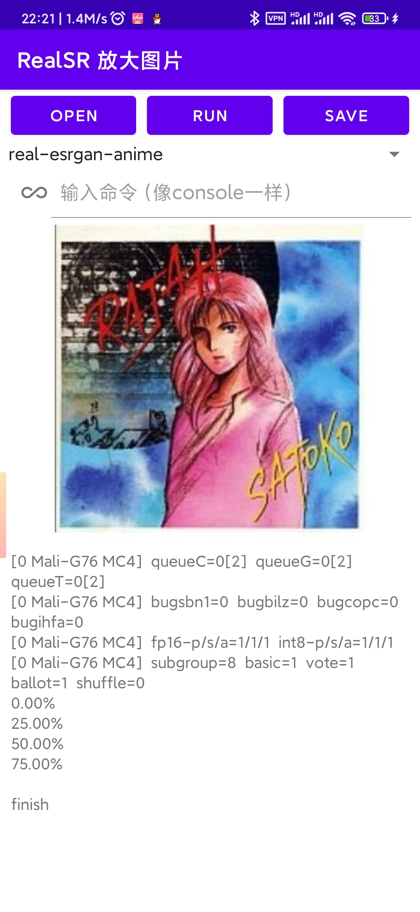
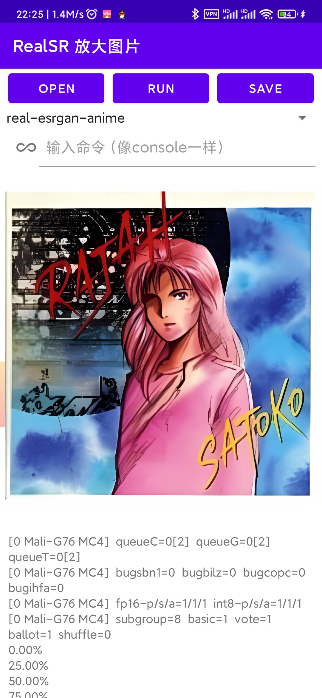
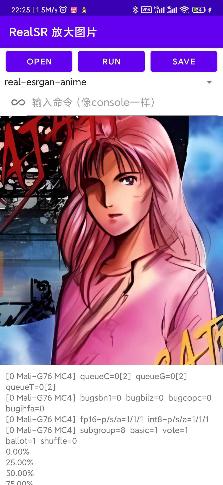

# RealSR-NCNN-Android

Real-ESRGAN is a Practical Algorithms for General Image Restoration.  
RealSR-NCNN-Android is a simple Android application that based on Realsr-NCNN & Real-ESRGAN.  
The application does not collect any private information from your device.  

This repository contains 2 project:  
1. RealSR-NCNN-Android-CLI can build a program that can be used by the console (for example, Termux) for Android.
2. RealSR-NCNN-Android-GUI can build a APK (has a GUI and easy to use). Actually it is a shell of the former. 

## how to build RealSR-NCNN-Android-CLI
### step1
https://github.com/Tencent/ncnn/releases
download ncnn-android-vulkan.zip or build ncnn for android yourself

### step2
extract ncnn-android-vulkan.zip into app/src/main/jni or change the ncnn_DIR path to yours in app/src/main/jni/CMakeLists.txt

### step3
open this project with Android Studio, rebuild it and then you could find the program in `RealSR-NCNN-Android-CLI\app\build\intermediates\cmake\debug\obj`


## how to use RealSR-NCNN-Android-CLI
### Example Command

```shell
realsr-ncnn-vulkan.exe -i input.jpg -o output.png
```

### Full Usages
```console
Usage: realsr-ncnn-vulkan -i infile -o outfile [options]...

  -h                   show this help
  -v                   verbose output
  -i input-path        input image path (jpg/png/webp) or directory
  -o output-path       output image path (jpg/png/webp) or directory
  -s scale             upscale ratio (4, default=4)
  -t tile-size         tile size (>=32/0=auto, default=0) can be 0,0,0 for multi-gpu
  -m model-path        realsr model path (default=models-DF2K_JPEG)
  -g gpu-id            gpu device to use (default=0) can be 0,1,2 for multi-gpu
  -j load:proc:save    thread count for load/proc/save (default=1:2:2) can be 1:2,2,2:2 for multi-gpu
  -x                   enable tta mode
  -f format            output image format (jpg/png/webp, default=ext/png)
```

- `input-path` and `output-path` accept either file path or directory path
- `scale` = scale level, 4 = upscale 4x
- `tile-size` = tile size, use smaller value to reduce GPU memory usage, default selects automatically
- `load:proc:save` = thread count for the three stages (image decoding + realsr upscaling + image encoding), using larger values may increase GPU usage and consume more GPU memory. You can tune this configuration with "4:4:4" for many small-size images, and "2:2:2" for large-size images. The default setting usually works fine for most situations. If you find that your GPU is hungry, try increasing thread count to achieve faster processing.
- `format` = the format of the image to be output, png is better supported, however webp generally yields smaller file sizes, both are losslessly encoded

If you encounter crash or error, try to upgrade your derive

## how to build RealSR-NCNN-Android-GUI
download Real-ESRGAN/RealSRGAN models and put them to this folder, then build it with Android Studio

``
RealSR-NCNN-Android-GUI\app\src\main\assets\realsr
│  libvulkan.so    
│  styletransferncnn
│  
├─models-DF2K_ESRGAN_anime
│      x4.bin
│      x4.param
│      
└─models-DF2K_ESRGAN
        x4.bin
        x4.param
		
``		


## how to build RealSR-NCNN-Android-GUI
You can open photo picker, chose a model, click the `Run` button and wait some time. The photo view will show the result when the progrem finish its work. If you like the result, you could click the `Save` button.  

Also the app could input shell command.

## screenshot

input & output

 


## Thanks to...
- https://github.com/xinntao/Real-ESRGAN for models
- https://github.com/nihui/realsr-ncnn-vulkan (Most of the code is copied from here, cause of the directory structure had to be adjusted, the original git was broken) 

## Other Open-Source Code Used

-   [https://github.com/Tencent/ncnn](https://github.com/Tencent/ncnn)  for fast neural network inference on ALL PLATFORMS
-   [https://github.com/webmproject/libwebp](https://github.com/webmproject/libwebp)  for encoding and decoding Webp images on ALL PLATFORMS (it was removed)
-   [https://github.com/nothings/stb](https://github.com/nothings/stb)  for decoding and encoding image on Linux / MacOS
-   [https://github.com/tronkko/dirent](https://github.com/tronkko/dirent)  for listing files in directory on Windows
