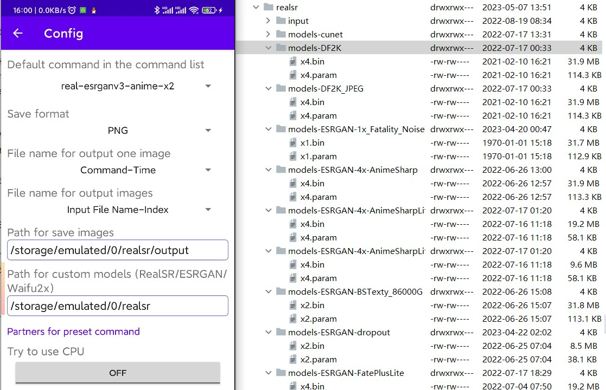

# RealSR-NCNN-Android

[English](https://github.com/tumuyan/RealSR-NCNN-Android/blob/master/README.md)

超分辨率是指将低质量压缩图片恢复成高分辨率图片的过程，用更常见的讲法就是放大图片并降噪。  
随着移动互联网的快速发展，智能设备逐渐普及到生活的每个角落。随之而来的是大量的图像数据。有的图片本身分辨率就比较低，难以看清楚细节；有的在存储和传输的过程中被反复压缩和劣化，最终不再清晰。  
为了获得更加高质量的视觉体验，或者出于更为基本的目的看清楚图片，图像恢复/超分辨率算法应运而生。而手机作为目前我们生活中最常使用的智能设备，显然有使用这一技术的迫切需求。  

这个仓库正是为安卓设备构建的一个图像超分辨率的应用。具有如下特点：  
  ✅ 内置超分算法和模型多。最初使用了[RealSR-NCNN](https://github.com/nihui/realsr-ncnn-vulkan)和[Real-ESRGAN](https://github.com/xinntao/Real-ESRGAN)的成果，后来又添加了[SRMD-NCNN](https://github.com/nihui/srmd-ncnn-vulkan)和[RealCUGAN-NCNN](https://github.com/nihui/realcugan-ncnn-vulkan), [Anime4KCPP](https://github.com/TianZerL/Anime4KCPP)。同时也内置了[waifu2x-ncnn](https://github.com/nihui/waifu2x-ncnn-vulkan)（但是没有内置模型和预设命令，如有需求自行下载并添加）  
  ✅ 兼顾传统插值算法。包括常见的nearest、bilinear、bicubic算法，以及imagemagick的二十多种filter。  
  ✅ 内置缩小算法。除使用用户指定倍率和算法的缩小方式外，resize-ncnn设计了一种自动缩小的算法de-nearest。参见[笔记](https://note.youdao.com/s/6XlIFbWt)  
  ✅ 支持图形界面和命令行两种操作方式使用。  
  ✅ 转换结果先预览，满意再导出，不浪费存储空间。  
  ✅ 导出文件自动按照模型和时间命名，方便管理。  
  ✅ 自定义优先选用的超分算法和模型。    
  ✅ 自定义预设命令。  
  ✅ 图片处理过程完全在本地运行，无需担心隐私泄漏、服务器排队、服务收费；处理耗时取于决选择的模型、图片大小以及设备的性能。  

### 下载地址 
[Github Release](https://github.com/tumuyan/RealSR-NCNN-Android/releases)  

### 仓库结构
1. RealSR-NCNN-Android-CLI 包含RealSR、RealCUGAN、SRMD、Waifu2x、Resize和Animk4k共6个模块，可以分别编译出对应的命令行程序，编译结果可以在安卓设备的Termux等虚拟终端中使用。其中:
  - RealSR 可以使用RealSR和Real-ESRGAN的模型。
  - Resize 可以使用了`nearest/最邻近`、`bilinear/两次线性`、`bicubic/两次立方`三种经典放大（interpolation/插值）算法，以及Lanczos插值算法相似的`avir/lancir`。特别的，nearest和bilinear可以通过`-n`参数，不使用ncnn进行运算，得到点对点放大的结果;当不使用`-n`。参数时，`-s`参数可以使用小数。
2. RealSR-NCNN-Android-GUI 可以编译出APK文件，这样用户可以在图形环境下操作。（不过他的本质就是在给上述命令行程序套壳，而不是通过JNI调用库文件）
3. Resize-CLI 可以编译出resize命令行程序，包含`nearest/最邻近`、`bilinear/两次线性`两种算法，不需要ncnn，编译体积较大。此工程除Android使用外，也可使用VS2019编译，在PC端快速验证。

## 如何使用 RealSR-NCNN-Android-GUI
支持两种选择文件的方式：
1. 从其他应用（比如图库）分享一个或多个图片到本应用
2. 在本应用中，点击`选图`选择图片

支持两种操作方式:
1. 点击`放大`（视图片大小和设备性能需要等待不同时间——毕竟原项目是使用电脑显卡运行的）- 查看放大效果是否满意，如果满意点击`导出`保存到相册。也可以在运行前切换使用的模型。切换模型后无需重新选择图片。运行过程中点击右上角进度可以终止运行；运行过程中切换模型并点击运行，或者直接输入命令并回车，可以终止上次任务并开始执行新的任务。
2. 直接在输入框内输入命令完成调用(可以输入help查看更多信息)

应用依赖于vulkan API，所以对设备有如下要求（几年前游戏《光遇》上架时，很多人已经对vulkan有所了解了吧？）：
1. 使用了比较新的SOC。经过实际测试，骁龙853（GPU Adreno510）可以处理较小的图片
2. 系统支持vulkan。（Google在Android7.0中增加了vulkan的集成，但是您的设备厂商不一定提供了这项支持）


## 为 RealSR-NCNN-Android-GUI 增加更多模型
RealSR-NCNN-Android-GUI 在 ver 1.7.6 以上的版本可以自动加载自定义模型。
你可以从 https://huggingface.co/tumuyan2/realsr-models 下载更多模型：
1. 在文件管理器里新建一个目录
2. 在App的设置中，自定义模型路径的选项里填入刚才新建目录的路径，点击保存
3. 下载模型并复制到刚才新建的目录里
5. 返回App，可以看到下拉菜单增加了新的模型



你自己也可以把pth格式的模型转换为本应用可用的ncnn模型。
1. 从 [https://upscale.wiki/wiki/Model_Database](https://upscale.wiki/wiki/Model_Database) 下载模型并解压
2. 下载  [cupscale](https://github.com/n00mkrad/cupscale) 并解压
3. 打开 CupscaleData\bin\pth2ncnn, 用 pth2ncnn.exe 转换 pth 文件为 ncnn 模型文件
3. 重命名文件，举例：
```
models-Real-ESRGAN-AnimeSharp  // 目录需要用 models-Real- 或 models-ESRGAN- 开头
├─x4.bin                       // 模型名称为 x[n], n 是放大倍率
├─x4.param
```

## 关于 Real-ESRGAN
Real ESRGAN是一个实用的图像修复算法，可以用来对低分辨率图片完成四倍放大和修复，化腐朽为神奇。
> [[论文](https://arxiv.org/abs/2107.10833)] &emsp; [[项目地址]](https://github.com/xinntao/Real-ESRGAN) &emsp; [[YouTube 视频](https://www.youtube.com/watch?v=fxHWoDSSvSc)] &emsp; [[B站讲解](https://www.bilibili.com/video/BV1H34y1m7sS/)] &emsp; [[Poster](https://xinntao.github.io/projects/RealESRGAN_src/RealESRGAN_poster.pdf)] &emsp; [[PPT slides](https://docs.google.com/presentation/d/1QtW6Iy8rm8rGLsJ0Ldti6kP-7Qyzy6XL/edit?usp=sharing&ouid=109799856763657548160&rtpof=true&sd=true)]<br>
> [Xintao Wang](https://xinntao.github.io/), Liangbin Xie, [Chao Dong](https://scholar.google.com.hk/citations?user=OSDCB0UAAAAJ), [Ying Shan](https://scholar.google.com/citations?user=4oXBp9UAAAAJ&hl=en) <br>
> Tencent ARC Lab; Shenzhen Institutes of Advanced Technology, Chinese Academy of Sciences


**现在的 Real-ESRGAN 还是有几率失败的，因为现实中的图片的降质过程比较复杂。**  

## 关于 RealSR
[[论文]](http://openaccess.thecvf.com/content_CVPRW_2020/papers/w31/Ji_Real-World_Super-Resolution_via_Kernel_Estimation_and_Noise_Injection_CVPRW_2020_paper.pdf) [[项目地址]](https://github.com/jixiaozhong/RealSR)  [[NTIRE 2020 Challenge on Real-World Image Super-Resolution: Methods and Results]](https://arxiv.org/pdf/2005.01996.pdf)

## 关于 SRMD
[[论文]](http://openaccess.thecvf.com/content_cvpr_2018/papers/Zhang_Learning_a_Single_CVPR_2018_paper.pdf) [[项目地址]](https://github.com/cszn/SRMD)  


## 关于 Real-CUGAN
[[项目地址]](https://github.com/bilibili/ailab/tree/main/Real-CUGAN)
Real-CUGAN是一个使用百万级动漫数据进行训练的，结构与Waifu2x兼容的通用动漫图像超分辨率模型。

## 关于 Anime4kCPP
[[项目地址]](- https://github.com/TianZerL/Anime4KCPP)
Anime4KCPP提供一个改进后的[bloc97的Anime4K](https://github.com/bloc97/Anime4K)算法0.9版本，同时也提供自己的CNN算法[ACNet](https://github.com/TianZerL/Anime4KCPP/wiki/ACNet)。Anime4KCPP提供多种使用方式，包括预处理与实时播放，其致力于成为高性能的视频或图像处理工具。
- Anime4K算法是一种简单且高质量的动漫类图像超分辨率算法，它并不使用机器学习，因此速度非常快，可用于实时处理和预处理。
- ACNet是一个基于卷积神经网络的超分辨率算法，旨在同时提供高质量和高性能。其中HDN模式能更好的降噪，HDN等级从1到3，越高降噪效果越好，但可能导致模糊和缺少细节。


## 如何编译 RealSR-NCNN-Android-CLI
### step1
https://github.com/Tencent/ncnn/releases  
下载 `ncnn-yyyymmdd-android-vulkan-shared.zip` 或者你自己编译ncnn为so文件  
https://github.com/webmproject/libwebp  
下载libwebp的源码
https://opencv.org/releases/  
下载opencv-android-sdk(供Anime4k使用)  

### step2
解压 `ncnn-yyyymmdd-android-vulkan-shared.zip` 到 `../3rdparty/ncnn-android-vulkan-shared`  
解压libwebp源码到`../3rdparty/libwebp`  
解压 `opencv-version-android-sdk` 到 `../3rdparty/opencv-android-sdk`  

```
RealSR-NCNN-Android
├─3rdparty

│   ├─opencv-android-sdk
│   │   └─sdk
│   ├─libwebp
│   └─ncnn-android-vulkan-shared
│       └─arm64-v8a
├─RealSR-NCNN-Android-CLI
│   ├─Anime4k
│   ├─RealCUGAN
│   ├─Waifu2x
│   ├─RealSR
│   ├─SRMD
│   └─ReSize
└─RealSR-NCNN-Android-GUI
```

### step3
用 Android Studio 打开工程, rebuild 然后你就可以在 `RealSR-NCNN-Android-CLI\*\build\intermediates\cmake\release\obj\arm64-v8a` 或 `RealSR-NCNN-Android-CLI\*\build\intermediates\cmake\debug\obj\arm64-v8a` 找到编译好的二进制文件。  
点击 `3rdparty/copy_cli_build_result.bat` 可以自动复制编译结果到 GUI 工程目录中

## 如何使用 RealSR-NCNN-Android-CLI
### 下载模型
你可以从 github release 页面下载 `assets.zip`, 或者从 https://github.com/tumuyan/realsr-models 下载所需模型，需要注意不同程序需要用对应的模型

### 命令范例
确认程序有执行权限，然后输入命令：
```shell
./realsr-ncnn -i input.jpg -o output.jpg
```

### 完整用法
仅以 realsr-ncnn 为例说明，其他程序使用方法完全相同，故不重复说明
```console
用法: realsr-ncnn -i 输入的图片路径 -o 输出的图片路径 [其他可选参数]...

  -h                   显示帮助
  -v                   显示更多输出内容
  -i input-path        输入的图片路径（jpg/png/webp路径或者目录路径）
  -o output-path       输出的图片路径（jpg/png/webp路径或者目录路径）
  -s scale             缩放系数(默认4，即放大4倍)
  -t tile-size         tile size (>=32/0=auto, default=0) can be 0,0,0 for multi-gpu
  -m model-path        模型路径 (默认模型 models-Real-ESRGAN-anime)
  -g gpu-id            gpu，-1使用CPU，默认0 多GPU可选 0,1,2
  -j load:proc:save    解码/处理/保存的线程数 (默认1:2:2) 多GPU可以设 1:2,2,2:2
  -x                   开启tta模式
  -f format            输出格式(jpg/png/webp, 默认ext/png)
  
```

## 如何编译 RealSR-NCNN-Android-GUI
从 github release 页面下载 `assets.zip` , 其中包含了模型和CLI程序, 解压并放置到如下路径, 然后使用 Android Studio 进行编译。
当前版本的下载连接为 https://github.com/tumuyan/RealSR-NCNN-Android/releases/download/1.9.1/assets.zip

```
RealSR-NCNN-Android-GUI\app\src\main\assets\
└─realsr
    │  Anime4k
    │  colors.xml
    │  delegates.xml
    │  libc++_shared.so
    │  libncnn.so
    │  libomp.so
    │  magick
    │  realcugan-ncnn
    │  realsr-ncnn
    │  resize-ncnn
    │  srmd-ncnn
    │  waifu2x-ncnn
    │  
    ├─models-nose
    │      up2x-no-denoise.bin
    │      up2x-no-denoise.param
    │      
    ├─models-pro
    │      up2x-conservative.bin
    │      up2x-conservative.param
    │      up2x-denoise3x.bin
    │      up2x-denoise3x.param
    │      up2x-no-denoise.bin
    │      up2x-no-denoise.param
    │      up3x-conservative.bin
    │      up3x-conservative.param
    │      up3x-denoise3x.bin
    │      up3x-denoise3x.param
    │      up3x-no-denoise.bin
    │      up3x-no-denoise.param
    │      
    ├─models-Real-ESRGAN
    │      x4.bin
    │      x4.param
    │      
    ├─models-Real-ESRGAN-anime
    │      x4.bin
    │      x4.param
    │      
    ├─models-Real-ESRGANv2-anime
    │      x2.bin
    │      x2.param
    │      x4.bin
    │      x4.param
    │      
    ├─models-Real-ESRGANv3-anime
    │      x2.bin
    │      x2.param
    │      x3.bin
    │      x3.param
    │      x4.bin
    │      x4.param
    │      
    ├─models-ESRGAN-Nomos8kSC
    │      x4.bin
    │      x4.param
    |
    └─models-se
           up2x-conservative.bin
           up2x-conservative.param
           up2x-denoise1x.bin
           up2x-denoise1x.param
           up2x-denoise2x.bin
           up2x-denoise2x.param
           up2x-denoise3x.bin
           up2x-denoise3x.param
           up2x-no-denoise.bin
           up2x-no-denoise.param
           up3x-conservative.bin
           up3x-conservative.param
           up3x-denoise3x.bin
           up3x-denoise3x.param
           up3x-no-denoise.bin
           up3x-no-denoise.param
           up4x-conservative.bin
           up4x-conservative.param
           up4x-denoise3x.bin
           up4x-denoise3x.param
           up4x-no-denoise.bin
           up4x-no-denoise.param
```

## 感谢
### 原始超分辨率项目
- https://github.com/xinntao/Real-ESRGAN
- https://github.com/jixiaozhong/RealSR
- https://github.com/cszn/SRMD
- https://github.com/bilibili/ailab/tree/main/Real-CUGAN
- https://github.com/bloc97/Anime4K

### ncnn项目以及模型
大部分C代码都来自nihui。由于Android直接编译比较困难，必须对项目目录做调整，因此破坏了原有Git。  
- https://github.com/nihui/realsr-ncnn-vulkan 
- https://github.com/nihui/srmd-ncnn-vulkan
- https://github.com/nihui/waifu2x-ncnn-vulkan
- https://github.com/nihui/realcugan-ncnn-vulkan
- https://github.com/TianZerL/Anime4KCPP

## 使用的其他开源项目
- [https://github.com/Tencent/ncnn](https://github.com/Tencent/ncnn)  for fast neural network inference on ALL PLATFORMS
- [https://github.com/nothings/stb](https://github.com/nothings/stb)  for decoding and encoding image on Linux / MacOS
- [https://github.com/tronkko/dirent](https://github.com/tronkko/dirent)  for listing files in directory on Windows
- [https://github.com/webmproject/libwebp](https://github.com/webmproject/libwebp) for encoding and decoding Webp images on ALL PLATFORMS
- [https://github.com/avaneev/avir](https://github.com/avaneev/avir) AVIR image resizing algorithm designed by Aleksey Vaneev
- [https://github.com/ImageMagick/ImageMagick6](https://github.com/ImageMagick/ImageMagick6) Use ImageMagick® to resize/convert images.
- [https://github.com/MolotovCherry/Android-ImageMagick7](https://github.com/MolotovCherry/Android-ImageMagick7) 

## 使用的其他模型
- Real-ESRGAN 模型 [Nomos8kSC](https://github.com/Phhofm/models/tree/main/4xNomos8kSC), 由 Phhofm 训练的一个适合处理相片的模型.